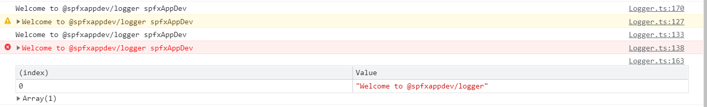

# @spfxappdev/logger

With this small and simple library, you can better manage your console logging. console.log() is a very often used method that also helps you a lot in the development. But there is one problem with it. It gets easily confusing and when the application goes live, you only want to output the important messages (e.g. console.warn() or console.error()). So what can be done to clean it up? Search for console.log in the code and delete it or comment it out? That doesn't have to be the case. With this library, you have your logging better under control, like a pro.

## Installation

`npm i @spfxappdev/logger`

## Usage

1. import the logger class into your project

```typescript
import { Logger } from '@spfxappdev/logger';
```

2. You can now create an instance. The first parameter is the category of the logger instance. It will be appended to all log outputs.

```typescript
const logger = new Logger("spfxAppDev");
```

3. Log to console

```typescript
logger.log("Welcome to @spfxappdev/logger");
logger.warn("Welcome to @spfxappdev/logger");
logger.info("Welcome to @spfxappdev/logger");
logger.error("Welcome to @spfxappdev/logger");
logger.table(["Welcome to @spfxappdev/logger"]);
```

4. Output in the Dev-Console
 


As you can see, the logcatergory `spfxAppDev` was appended to the outputs.

## Settings

The "Logger" constructor has a second, optional parameter for the settings. The following settings can be set and are default:

```typescript
const loggerSettings: ILoggerSettings = {
    LogNamespaceUrlParameterName: 'LogOnly',
    LoggingEnabledUrlParameterName: 'EnableConsoleLogging',
    LoggingEnabled: {
        EnableAll: true,
        EnableError: true,
        EnableInfo: true,
        EnableLog: true,
        EnableTable: true,
        EnableWarn: true
    }
}
```

### Override default settings per instance
If you want to override the default settings, you can do it like this:

```typescript
const myLoggerSettings: ILoggerSettings = {
    LogNamespaceUrlParameterName: 'LogOnlyMy',
    LoggingEnabledUrlParameterName: 'EnableLogging',
    LoggingEnabled: {
        EnableAll: false,
        EnableError: true,
        EnableInfo: false,
        EnableLog: false,
        EnableTable: false,
        EnableWarn: true
    }
}

const logger = new Logger("spfxAppDev", myLoggerSettings);
```

### Override default settings globally
If you want to override the default settings, you can do it like this:

```typescript
const myLoggerSettings: ILoggerSettings = {
    LogNamespaceUrlParameterName: 'LogOnlyMy',
    LoggingEnabledUrlParameterName: 'EnableLogging',
    LoggingEnabled: {
        EnableAll: false,
        EnableError: true,
        EnableInfo: false,
        EnableLog: false,
        EnableTable: false,
        EnableWarn: true
    }
}

Logger.DefaultSettings = myLoggerSettings;
```

**Important**: This only works if the settings were overwritten first and then the instances were created. Also, you then have to make sure that the overwritten code is imported everywhere.

## URL Handling

For the production environment, you may want to disable the settings for console.log() so that the console doesn't get too crowded. The problem is then: When analyzing errors, you want to activate logging for a short time without having to adjust the code. For this the URL parameters were introduced. With these URL parameters you can still enable logging. You can even activate only certain logging categories.

### Enable Console Logging via URL

Just add the URL parameter `EnableConsoleLogging` and it is activated. 

Example: `http://localhost:1234?EnableConsoleLogging=1`

**Note**: The URL parameter corresponds to the one from the settings (`ILoggerSettings.LoggingEnabledUrlParameterName`)

### Only certain categories log via URL
Just add the URL parameter `LogOnly` and it will be log only this categories). 

Example: `http://localhost:1234?LogOnly=spfxAppDev`

You can filter several categories if you separate the categories with a comma

Example: `http://localhost:1234?LogOnly=spfxAppDev,spfxAppDev2,spfxAppDev3`

**Note**: The URL parameter corresponds to the one from the settings (`ILoggerSettings.LogNamespaceUrlParameterName`)


## Decorators
To use the logging decorators, you have to set the `experimentalDecorators` property to `true` in your `tsconfig.json`

### Usage

Import:

```typescript
import { log } from '@spfxappdev/logger';
import { ILogger } from '@spfxappdev/logger/library/ILogger';
```

####  Class Decorator

```typescript
//For Intellisense with the @classLogger(), use this:
interface TestAppWithDecorators extends ILogger { }
     

@log({
    customLogCategory: "myCustomLoggingCategory"
})
class MyClassWithDecorators { }
```

####  Method Decorator
```typescript
@log({
    customLogCategory: "myCustomLoggingCategory"
})
class MyClassWithDecorators { 
    @log()
    public doThings(): void {
        this.logger.log("Hello World");
    }
}
```

####  Property Decorator
```typescript
@log({
    customLogCategory: "myCustomLoggingCategory"
})
class MyClassWithDecorators { 
    @log()
    public myProp: string = "";

    @log()
    public doThings(): void {
        this.logger.log("Hello World");
    }
}
```